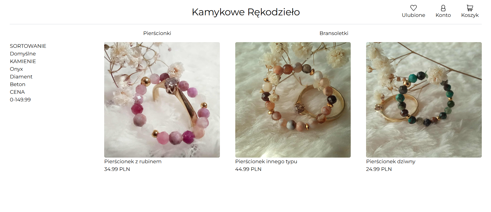

# 🚧 WORK IN PROGRESS 🚧

https://kamykowe-rekodzielo.pl/

## About this project

This project was created as a learning and self‑education exercise focused on **Next.js** and other **frontend technologies**.

The long‑term goal of this repository is to serve as a foundation for launching a **real e‑commerce application**, built with production‑ready tooling, infrastructure, and best practices.

At its current stage, the project is under active development and experimentation.
